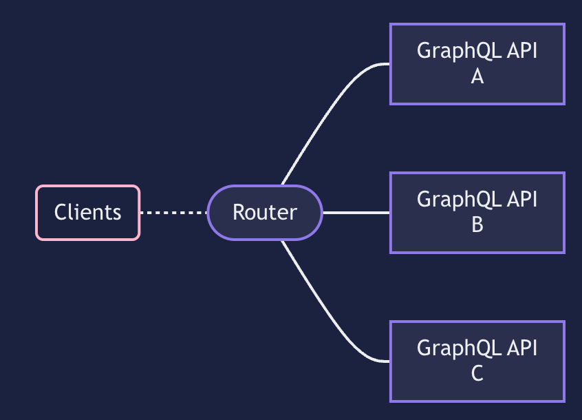

# WARNING

Open each Go service (subgraph-1 and subgraph-2) individually inside your editor of choice. Opening the whole project will result in module import issues.

# About

This repo shows how you can make a supergraph. A supergraph is a collection of graphQL subgraphs connected to a single router. The router combines the schemas of the subgraphs into one super schema and provides a single "router" for the clients to make requests to.

Benefits of a supergraph over a single GraphQL API:

- backend teams can deploy their service independantly, benefitting from a microservices architecture, whilst providing a single backend service to clients.
- client can fetch all the data they need in a single request, irrespective of how complex the backend is architectured.

