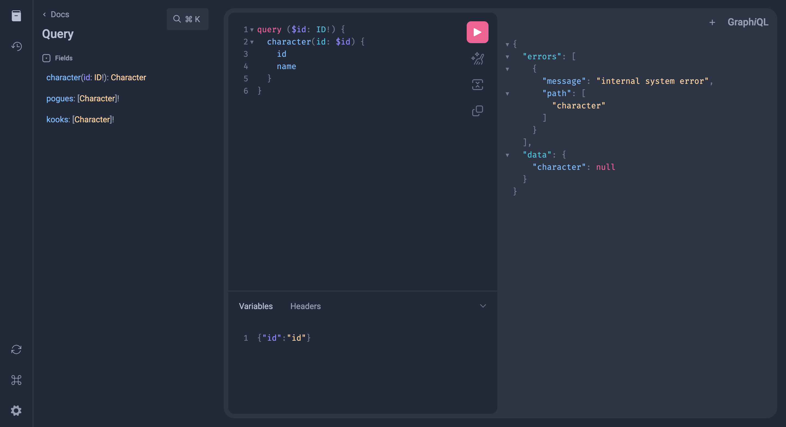

# How to generate the schema code

1. Run the following command at the root level

```shell
go run github.com/99designs/gqlgen generate
```

# Tutorials

## How to make a Go GraphQL API

https://www.apollographql.com/blog/graphql/golang/using-graphql-with-golang/

## How to turn a Go GraphQL API into a Subgraph

https://gqlgen.com/recipes/federation/

# Querying in the playground



# How to run the application

```shell
go run server.go
```
